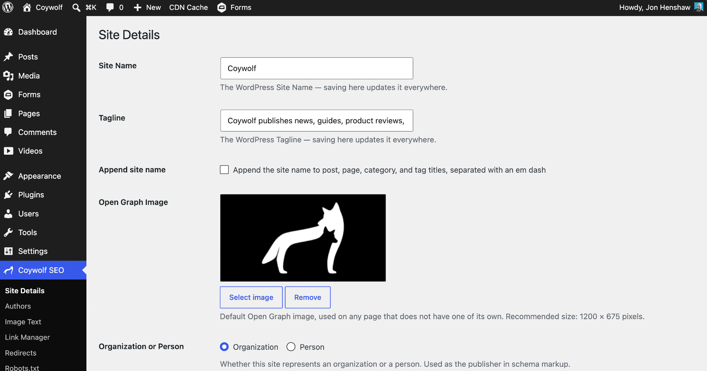
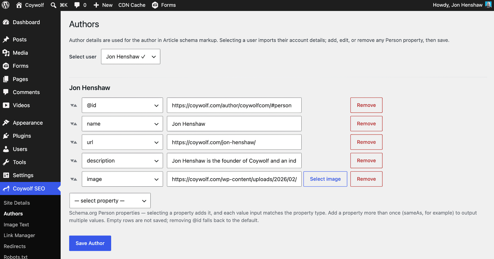
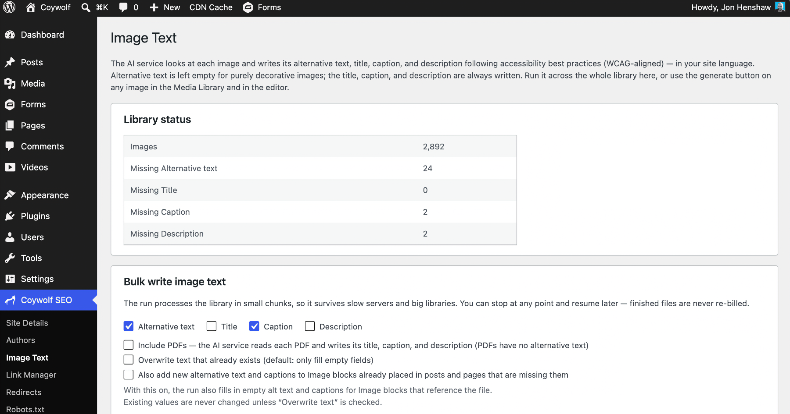
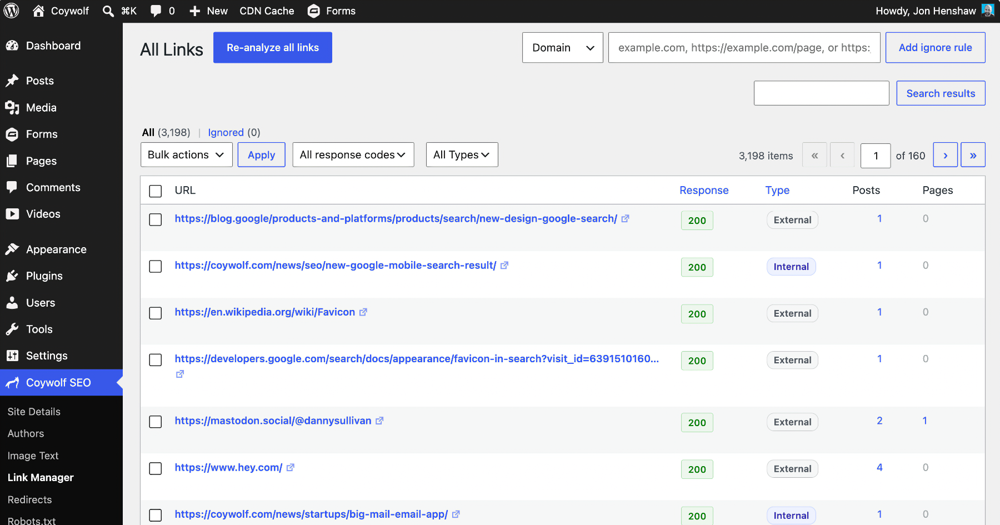
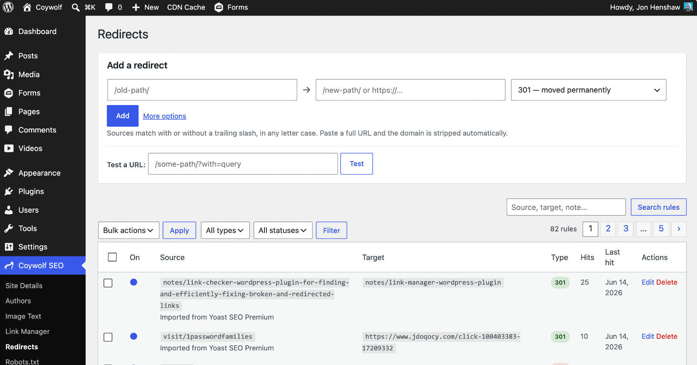
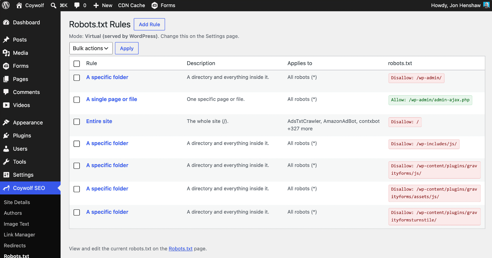
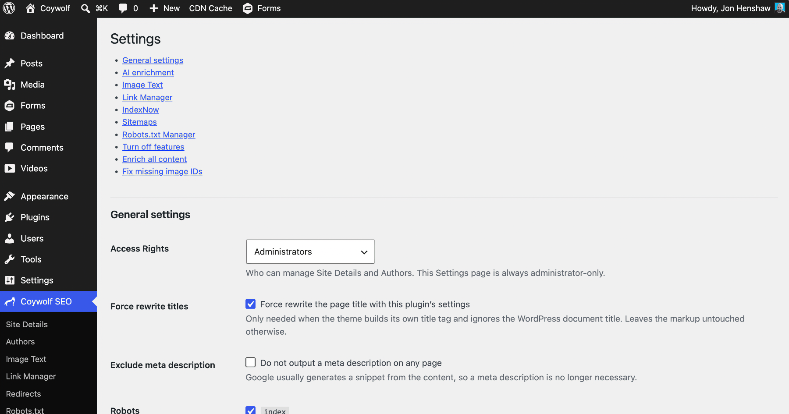
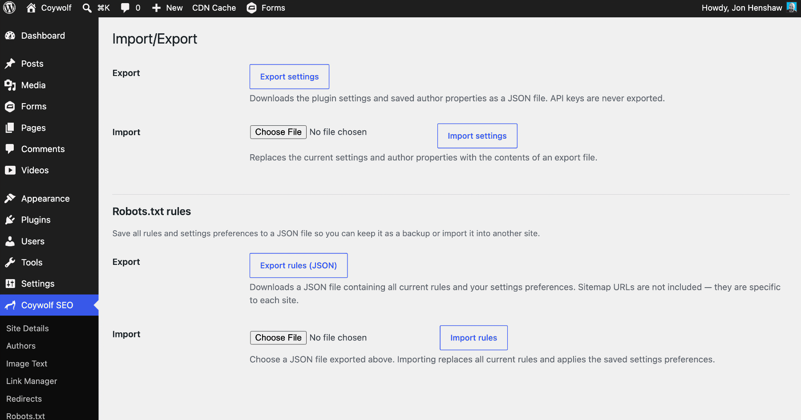

# Coywolf SEO

An SEO plugin that has exactly what you need, and nothing more.

- **Version:** 1.0.110
- **Requires WordPress:** 7.0+
- **Requires PHP:** 7.4+
- **License:** GPL-2.0-or-later

## Description

Coywolf SEO is built on a simple idea: an SEO plugin should give you exactly what you need, and nothing more. No upsells, no nags, no bloat, no features you have to turn off — just the essentials, done right, with the plugin doing the heavy lifting in the background.

### Features

- **Site Details** — one screen for your site's identity: the Site Name and Tagline (editable right there), whether titles append the site name (em dash separated), the default Open Graph image, whether the site represents an Organization (with a full Schema.org property picker whose inputs match each property — URL, email, date, image upload, structured address and contact point) or a Person, the homepage title and description, and schema type defaults for posts and pages.
- **Titles** — clean titles composed from your settings. The site name is appended only where you turn it on. A force-rewrite option handles themes that build their own title markup.
- **Meta description** — by default the homepage uses your description (default: the Tagline), posts and pages use their manual excerpt, and terms use their description; nothing is auto-generated unless you turn on AI meta descriptions (see *AI Schema enrichment*). One checkbox excludes meta descriptions entirely — search engines generate snippets from content anyway.
- **Robots meta** — `index, follow, max-image-preview:large, max-snippet:-1, max-video-preview:-1` by default, each directive toggleable.
- **Canonical links** — on the homepage, posts, pages, categories, and tags, with pagination handled and a per-post canonical override.
- **SEO section on posts and pages** — an SEO panel in the block editor's document sidebar (and a classic-editor meta box) to override the schema page/article type, set Noindex/Nofollow, or replace the canonical link.
- **Duplicate Post** — a Duplicate link under each post and page title (right next to Edit) copies it to a new draft: content, excerpt, categories and tags, featured image, page template, and custom fields included — your SEO settings among them. The draft belongs to whoever made it, WordPress assigns a fresh slug and date, and the original's old-URL redirect history stays where it belongs, so the copy never competes with the original.
- **Table of Contents block** — builds its list when the page is served, not when the post is saved, so it can never go stale: headings get clean anchor links automatically (hand-set anchors are kept, duplicate headings de-duplicated), headings added by shortcodes and synced patterns are included, and every heading block gets its own "Exclude from table of contents" toggle. Pick which heading levels are listed (H2–H6), edit the title and its heading level, choose plain, bulleted, or hierarchical numbering (1, 1.1, 1.2…), make the table collapsible (works without JavaScript), and turn on smooth scrolling (reduced-motion preferences are respected), current-section highlighting while reading, and a scroll offset so sticky headers never cover a jumped-to heading. A minimum-headings threshold leaves the table off short posts, the markup is a semantic `nav` with properly nested lists, pages with the block declare the `tableOfContents` accessibility feature in their schema, and a Yoast table-of-contents block converts to this one in one click.
- **Mobile alternative image** — the core Image block gains an *Add mobile alternative* control: pick a phone-specific image (a different crop, dimensions, or content) and the plugin serves it on small screens through a `<picture>` element with a `max-width: 768px` media query, while larger screens keep the desktop image. Because it's a real media query (art direction) rather than a `srcset` swap, the mobile image is guaranteed below the breakpoint instead of left to the browser's candidate guesswork. The desktop image and its lightbox are untouched, and the breakpoint is filterable.
- **Schema markup** — one JSON-LD graph per page: WebSite, your Organization (with every property you added) or Person as the publisher, the typed WebPage, the typed Article with its author, and CollectionPage on category and tag archives.
- **Authors** — pick a user and the plugin imports their account details as Schema.org Person properties; add anything from the full Person catalog. Used as the author in Article markup.
- **Open Graph** — og: tags on the homepage, posts, pages, categories, and tags, with the featured image falling back to your default Open Graph image. Categories and tags can carry their own Page Title (used for the page title and Open Graph title) and their own Open Graph image, set right on the term screens. No Twitter/X tags — X reads Open Graph.
- **Access rights** — choose whether Editors can manage the plugin alongside Administrators.
- **Takes over from other SEO plugins** — with Yoast SEO, Rank Math, All in One SEO, SEOPress, or The SEO Framework also active, their front-end output (titles, descriptions, schema, Open Graph, robots, canonical) and their edit-screen boxes and sidebars are suppressed through each plugin's own switches, so nothing is duplicated while you migrate. Their sitemaps and redirects are left running.
- **Hide the category prefix** — serve category archives at `/news/` instead of `/category/news/`, with 301 redirects from the old URLs.
- **IndexNow** — ping Bing the moment a post or page is published, updated, or deleted. The site key is generated for you and served virtually; no file is written.
- **Native sitemap exclusions** — drop the Posts, Pages, Categories, or Users sitemaps from WordPress's own `/wp-sitemap.xml`; everything not excluded stays exactly as WordPress generates it.
- **News sitemap** — optionally serve `/coywolf-news-sitemap.xml` with articles from the last 48 hours; choose whether posts and/or pages are included and which categories are in or out.
- **LLMs.txt & Markdown source endpoints** *(off by default; under Settings → Discovery)* — make your site agent-readable. When enabled, the plugin serves a spec-conformant [`/llms.txt`](https://llmstxt.org/) index of your public content (one H2 file-list per post type, plus an optional **topic index** that groups your articles under the AI-enriched entities they're primarily about — an entity earns a section once it's the primary subject of a configurable number of articles (default 2), and every link points back at your own pages, not at external knowledge), and exposes a Markdown source for every public page at `…/index.html.md` — the page's fully-rendered content converted to Markdown from the *same* render path as the HTML, with YAML frontmatter (title, canonical URL, updated date, licence, and the page's entities) and an `X-Markdown-Tokens` header. Each page also advertises its Markdown via a `<link rel="alternate" type="text/markdown">` and answers `Accept: text/markdown` content negotiation (with `Content-Location` and `Vary: Accept`). Everything honors the same visibility as your sitemaps (public, published, non-`noindex` only), is built entirely from on-site data with no external calls, and is never written over an `llms.txt` another plugin already owns (it detects and defers). The settings nav groups this with **IndexNow** and **Sitemaps** under a new **Discovery** section.
- **AI Schema enrichment** — bring your own API key for **Claude (Anthropic), OpenAI, or Google Gemini** — pick one service in Settings — and it analyzes each post in the background as it is published: main subjects land in the Article schema's `about` property, passing references in `mentions`, each grounded to a real Wikidata item with its Wikipedia page in `sameAs`. The model only ever extracts entity names — real candidates are looked up on Wikidata's public API, the model chooses among them, and the chosen item's type is verified — so identifiers are never invented. When new entities land, the page's cache is purged (Rocket.net edge cache and the common cache plugins) so the schema is served immediately. Enrich-all runs go through the selected service's Batch API at roughly half the standard token price, with live progress, pause/resume/cancel, and a lifetime average-cost-per-post readout. Turn on automatic meta descriptions and it also writes a faithful sub-200-character summary of each post as it is published or updated — it replaces the excerpt in the meta description, Open Graph, and Article schema, and the option steps aside whenever meta descriptions are excluded. The key can live in `wp-config.php` (`ANTHROPIC_API_KEY`, `OPENAI_API_KEY`, or `GEMINI_API_KEY`). Built on WordPress 7.0's bundled AI client, so the AI features require WordPress 7.0 or higher.
- **Image Text** — generate alt text, captions, titles, and descriptions for your Media Library images with the same AI service — one image at a time from the block editor, or in bulk across the whole library. The bulk run processes in the background (through the Batch API at roughly half price, or in real time on demand), so you can leave the page. Alt text is intentionally left empty for purely decorative images, an accessibility best practice, and the prompt is WCAG-aware. New alt text and captions can propagate into the matching `core/image` blocks already placed in your content, and a *Fix missing image IDs* tool re-attaches Media Library IDs to images inserted without one — converting Custom HTML or classic image figures into real image blocks along the way.
- **Redirects** — a full redirect manager on one screen: quick-add a rule in seconds (exact or regex with capture groups, query strings ignored/passed/matched exactly, 301/302/307/308/410), test any URL against your rules before trusting the live site, and watch hit counts to see which rules still matter. The moment you delete a published post or page, the plugin asks right there on the list screen what to do with its URL — mark it gone (410), redirect it, or dismiss — and pending decisions also wait on the Redirects page. Rules can be imported from the Redirection plugin (even when it's deactivated — its saved records are read straight from the database) and from Yoast SEO Premium, with duplicates skipped so re-running is safe; when either plugin is active, a banner offers the import — nothing is imported without your say-so. When the Redirection plugin is active, Coywolf SEO also takes over its URL redirects: Redirection's URL redirects are switched off while this feature is on so they don't conflict with yours, and a notice on Coywolf SEO's screens points it out so you can import its rules and deactivate it (its 404/410, random, and site-wide HTTPS/www redirects keep running until you do). No log tables, no groups to configure, and a `COYWOLF_SEO_DISABLE_REDIRECTS` constant as a lockout escape hatch.
- **Link Manager** — scans every link in your posts and pages and lists them on one screen with their HTTP response, internal/external type, and the posts and pages each one appears in, so broken links (4xx/5xx) and redirects are easy to spot. Links that answer `429` or `999` are shown as **Blocked** rather than broken — those codes almost always mean the destination is refusing automated or server-side requests (rate-limiting or bot-blocking), not that the link is dead, so they are kept out of the broken count. Fix them in place — remove a link, replace a redirect with its final destination, or change a link's URL everywhere it appears — one at a time or in bulk. Ignore individual URLs, whole domains, or wildcard patterns so known-good links stop cluttering the list, with a separate Ignored view to manage them. After the first analysis the inventory keeps itself current as posts and pages are created, edited, or deleted, and a Throughput setting tunes how hard it scans.
- **Robots.txt Manager** — manage robots.txt from the WordPress admin as a table of named, plain-English rules. A guided editor builds the correct `Disallow`/`Allow` directive by rule type (a folder, a path prefix, a file type, all query-string URLs, an allow-exception, and more) and targets all robots, hand-entered custom bots, or whole categories from the bundled Cloudflare Bot Directory; every rule is conflict-checked against your existing rules and testable against a URL before you save — all powered by a PHP port of **Google's open-source Robots.txt Parser and Matcher Library** (the Robots Exclusion Protocol / RFC 9309 reference implementation Googlebot itself uses), so each rule is validated and previewed exactly the way Google will interpret it: `*` wildcards, `$` end-anchors, percent-encoding, and longest-match Allow/Disallow precedence all included. Serve robots.txt virtually (WordPress serves it with your managed rules injected) or write a real file with your hand-written lines preserved. On activation it imports and tidies an existing robots.txt — repairing common mistakes, dropping deprecated and render-blocking directives, and de-duplicating Sitemap links. Sitemap URLs and physical/virtual mode live in Settings; rules import and export as JSON on the Import/Export page.
- **Import/Export** — download the plugin settings, author properties, and redirect rules as JSON and import them on another site. API keys are never exported.
<!-- labs-strip:start -->
- **Labs → Open Knowledge Format (OKF) export** *(experimental, off by default)* — opt in on the **Labs** page and the plugin generates an [Open Knowledge Format](https://github.com/GoogleCloudPlatform/knowledge-catalog/tree/main/okf) v0.1 bundle of your public content: a navigable graph of Markdown concepts for every published article, topic, and author, cross-linked to the AI-enriched entities each page is *about* or *mentions* — each entity grounded to its Wikidata QID and Wikipedia page so an agent gets a stable identifier for disambiguation, not a copy of your page text. It is built entirely from data already on your site (no new external calls). Download the bundle as a `.zip`, or let an agent traverse it live at a `/okf/` read endpoint; it rebuilds in the background as content changes, with a manual *Rebuild* button. An optional **Advertise the bundle publicly** sub-setting (on by default once OKF is enabled, independently toggleable) points AI agents at the canonical `/okf/` root from the places they look — a referenced `llms.txt`, a single `<link rel="alternate">` in the page `<head>` on indexable pages, and a `robots.txt` allowance — without ever overwriting an `llms.txt` or `robots.txt` owned elsewhere (it detects those and shows the exact line to add by hand). OKF defines no automatic discovery, so this is honest advertising, not a guarantee anything consumes it. The whole feature — its toggle, settings, and cleanup — is managed on the Labs page; disabling it stops serving and offers to remove the generated files. Labs ships in the GitHub distribution only.
<!-- labs-strip:end -->

<!-- wporg-strip:start -->
Updates are delivered straight from the project's GitHub releases via the bundled self-updater, so new versions show up on **Dashboard → Updates** like any other plugin.
<!-- wporg-strip:end -->

## Installation

1. Upload the plugin to `wp-content/plugins/coywolf-seo` or install the zip from **Plugins → Add New → Upload Plugin**.
2. Activate it.

## Troubleshooting

- **No new tags on the front end?** Purge your page and CDN caches (including host-level edge caching) — cached pages keep serving pre-activation HTML. The plugin purges the common cache plugins on activation, but host and CDN caches are outside its reach.
- **No Article schema on a page?** Pages default to no Article type (Site Details → Pages); set a default there or override per page in the SEO panel.
- **No meta description on a post?** By default it comes only from a manual excerpt — turn on AI meta descriptions to generate one automatically, or exclude meta descriptions entirely in Settings.
- **Nothing at all?** The theme must call `wp_head()` — all output renders there.

## Privacy

Privacy-first: this plugin includes no analytics, no tracking, and no data gathering — nothing about you, your site, or your visitors is ever collected. Outbound connections happen only for features you turn on, and each is detailed under **External services** below: with IndexNow enabled, the changed URL is sent to Microsoft Bing's IndexNow endpoint on publish, update, and delete; with AI enrichment or Image Text enabled, the post title and content — and, for Image Text, the image itself — are sent to the AI service you choose (Anthropic, OpenAI, or Google Gemini) using your own API key, and extracted entity names are looked up on Wikidata's public API; and with the Link Manager enabled, the plugin requests the URLs you have linked to in your own content to check whether they still work. Nothing else, nowhere else.

## External services

This plugin can connect to the third-party services below. Each is optional and is contacted only when you enable the feature that uses it; none are contacted on a default install.

### AI provider — Anthropic, OpenAI, or Google Gemini (you choose one)

Used by **AI Schema enrichment**, **AI meta descriptions**, and **Image Text**. When you enable an AI feature and supply your own API key, the plugin sends content to the single service you selected in Settings:

- *AI Schema enrichment* sends a post or page's title and text content when it is published or updated (or when you run "Enrich all content"), so the model can extract entity names.
- *AI meta descriptions*, when enabled, send a post's content on publish/update to generate a short summary.
- *Image Text* sends the image (and the surrounding post text for context) when you generate text for an image or run the bulk job.

Requests are authenticated with the API key you provide and are sent only to the one service you select. Terms and privacy policy for each:

- Anthropic (Claude) — [Commercial Terms](https://www.anthropic.com/legal/commercial-terms) · [Privacy Policy](https://www.anthropic.com/legal/privacy)
- OpenAI — [Terms of Use](https://openai.com/policies/terms-of-use/) · [Privacy Policy](https://openai.com/policies/privacy-policy/)
- Google Gemini API — [Terms of Service](https://ai.google.dev/gemini-api/terms) · [Privacy Policy](https://policies.google.com/privacy)

### Wikidata (Wikimedia Foundation)

Used by **AI Schema enrichment** to ground entities to real identifiers. The entity-name strings extracted from your content are sent as lookups to Wikidata's public API (`https://www.wikidata.org/w/api.php`); no API key and no personal data are involved. [Terms of Use](https://foundation.wikimedia.org/wiki/Policy:Terms_of_Use) · [Privacy Policy](https://foundation.wikimedia.org/wiki/Policy:Privacy_policy)

### IndexNow (Microsoft Bing)

Used by the **IndexNow** feature. When enabled, the URL of a post or page you publish, update, or delete — together with the auto-generated site key — is submitted to Bing's IndexNow endpoint (`https://www.bing.com/indexnow`) so search engines can recrawl it promptly. No personal data is sent. [About IndexNow](https://www.indexnow.org/) · [Microsoft Privacy Statement](https://privacy.microsoft.com/privacystatement)

### Link checking (the sites you link to)

Not a third-party service, noted here for transparency: when the Link Manager is enabled, it sends HTTP HEAD (and, if needed, GET) requests to the URLs you have linked to in your posts and pages to record each link's HTTP status. Those requests go to the sites you chose to link to — never to Coywolf or any other service — and carry only an ordinary request with a plugin User-Agent; no information about your site or your visitors is transmitted.

## Frequently Asked Questions

### Does the plugin auto-generate titles and meta descriptions?

Titles are composed from your settings, with the site name appended only where you enable it (a force-rewrite option handles themes that build their own title tag). Meta descriptions are never auto-generated — the homepage uses the Tagline, posts and pages use their manual Excerpt, terms use their description — unless you turn on AI meta descriptions or exclude meta descriptions entirely.

### Why don't my pages show Article schema?

Each page outputs one JSON-LD graph, but pages default to no Article type. Set a default in Site Details → Pages, or override it per page in the SEO panel.

### Which AI service does enrichment use, and what do I need?

Bring your own API key for Claude (Anthropic), OpenAI, or Google Gemini and pick one in Settings (or define it in `wp-config.php`). The AI features require WordPress 7.0+ because they run on its bundled AI client.

### Can the AI invent entities or make up schema?

No. The model only extracts entity names; the real items are looked up on Wikidata's public API, the model chooses among them, and the chosen item's type is verified — so identifiers are never fabricated.

### What does "Enrich all content" cost, and how long does it take?

It runs through your service's Batch API at roughly half the standard token price, in the background, and can take up to an hour. Posts already analyzed with the current settings are skipped, so re-running is inexpensive.

### If I turn AI enrichment off, do I lose my data?

No — detected entities and generated descriptions and image text are kept and still used. Only your saved API key is deleted (re-enter it when you turn AI back on; a key in `wp-config.php` is ignored while off).

### Does the bulk "Write image text" run need the page to stay open?

No. It processes in the background on WP-Cron, so you can leave and come back to check progress. On a very low-traffic site, leaving the tab open helps it along.

### What's the difference between Batch and real-time image text?

Bulk image text defaults to the cheaper Batch API (about half price; results within the hour, up to 24 hours). Tick "real-time" for immediate processing at the standard rate. Gemini has no vision Batch API, so it always runs in real time.

### Why is some image alt text left blank?

Alt text is intentionally left empty for purely decorative images (an accessibility best practice). Title, caption, and description are always written.

### What does "Fix missing image IDs" do?

Two things, each only when an uploads-folder image exactly matches a Media Library item: it adds the missing attachment ID to in-content images, and it converts Custom HTML or classic image figures into real image blocks. Run Preview first — it edits post content — and note that converting drops any custom inline figure styling.

### Why aren't my in-content images getting the new alt text and captions?

Propagation only updates `core/image` blocks that reference the file, and only empty fields unless "Overwrite" is on. Images added as Custom HTML or by URL aren't matched until you run "Fix missing image IDs" first.

### What happens to a deleted post's URL?

The moment you delete a published post or page, the Redirects screen asks what to do with its URL — mark it gone (410), redirect it, or dismiss. Pending decisions also wait on the Redirects page.

### Can I import redirects from another plugin?

Yes — from the Redirection plugin (even when it's deactivated, read straight from the database) and from Yoast SEO Premium. Duplicates are skipped, so importing is safe to re-run.

### Does the Link Manager re-scan everything every time?

Only the first analysis is a full scan; after that the inventory keeps itself current as you create, edit, and delete posts. A Throughput setting tunes how hard it scans.

### Why are some links shown as "Blocked" instead of broken?

A link that answers `429` (Too Many Requests) or `999` (the non-standard code LinkedIn and Yandex return) is marked **Blocked** rather than broken. Those codes almost always mean the destination is rate-limiting or refusing automated and datacenter requests — which is unavoidable from your server and does not mean the link is dead — so the Link Manager keeps them out of the broken count and groups them under a single "Blocked" filter.

### How accurate is the robots.txt rule tester?

It runs on a PHP port of Google's open-source Robots.txt Parser and Matcher Library — the Robots Exclusion Protocol (RFC 9309) reference implementation Googlebot uses — so the Test URL result, the conflict warnings, and the redundancy checks all reflect exactly how Google will interpret a rule, including `*` wildcards, `$` end-anchors, percent-encoded paths, and Allow-vs-Disallow longest-match precedence. What the plugin previews is what Googlebot will do.

### What's the difference between virtual and physical robots.txt?

Virtual (the default) means WordPress serves robots.txt with your managed rules injected — no file is written. Physical mode writes a real file and preserves your hand-written lines. On activation, the manager imports and tidies any existing robots.txt.

### Can I get my original robots.txt back?

Yes. Turning the Robots.txt Manager off — or deactivating the plugin — prompts you to restore your original robots.txt or keep the managed rules.

### Why doesn't the table of contents go out of date?

It's built when the page is served, not when you save, so headings added later (including by shortcodes and synced patterns) are always included. Each heading has an "Exclude from table of contents" toggle, and a minimum-headings threshold keeps the table off short posts.

### How is the mobile alternative image different from normal responsive images?

It's true art direction: your phone-specific image is served below 768px through a `<picture>` media query, so it's guaranteed on small screens rather than left to the browser's `srcset` guesswork. The breakpoint is filterable.

### Does this conflict with Yoast, Rank Math, or AIOSEO?

No. While the other plugin is active, Coywolf SEO suppresses its front-end output and edit-screen boxes through that plugin's own switches, so nothing is duplicated as you migrate — but it leaves their sitemaps and redirects running.

### Are there Twitter/X meta tags?

No — X reads Open Graph, so only `og:` tags are output. Categories and tags can also carry their own Page Title and Open Graph image, set right on the term screen.

### Does Duplicate Post copy my SEO settings?

Yes — it copies the content, excerpt, taxonomies, featured image, template, and custom fields, including the SEO meta, into a new draft you own with a fresh slug and date. The original's old-URL redirect history stays with the original.

### What happens to my data if I turn a feature off, deactivate, or delete the plugin?

Turning a feature off keeps all of its data and just hides it (turning AI off also deletes the saved API key). Deactivating keeps everything and only pauses background jobs. Deleting removes all of the plugin's data, so back up first — but edits the tools made to your content (added image IDs, converted blocks, image text saved to the Media Library) remain, because those live in WordPress itself.

### Does Import/Export include my API keys?

No. Settings, author properties, and redirect rules export as JSON; API keys are never exported.

## Screenshots

**Site Details** — The Site Details screen, where the site name, tagline, default Open Graph image, and Organization-or-Person setting (used as the publisher in schema markup) are configured.

**Authors** — The Authors screen, showing the Schema.org Person properties (@id, name, url, description, image) used for the author in Article schema markup, with controls to add, edit, or remove each property.

**Image Text** — The Image Text screen, with a Library status panel reporting the total image count and the number missing alt text, titles, captions, and descriptions, plus bulk options for AI-written, WCAG-aligned image text.

**Link Manager** — The Link Manager's All Links view, listing every internal and external link with its response code, type, and the number of posts and pages where it appears.

**Redirects** — The Redirects screen, with the Add a redirect form, a URL tester, and a table of existing redirect rules showing source, target, type, hits, and last-hit date.

**Robots.txt Rules** — The Robots.txt Rules screen in Virtual mode, listing each rule with its description, the robots it applies to, and the resulting allow or disallow directive.

**Settings** — The Settings screen, with an in-page table of contents and the General settings section covering access rights, force-rewrite-titles, meta description, and robots indexing options.

**Import/Export** — The Import/Export screen, with controls to export and import plugin settings and author properties as JSON, and a separate section for exporting and importing Robots.txt rules.

## Changelog

### 1.0.110
- Fix: decode HTML entities in titles for llms.txt + .md frontmatter (#111).

### 1.0.109
- llms.txt intro: describe the entity topic index when present (#110).

### 1.0.108
- Rework llms.txt entities into a topic index of the site's own articles (#109).

### 1.0.107
- Fix: /llms.txt + .md endpoints 404 (rewrite flush timing) (#108).

### 1.0.106
- Hide LLMs.txt sub-options until the feature is enabled (#107).

### 1.0.105
- Drop the Discovery/Robots.txt group labels from the settings jump list (#106).

### 1.0.104
- Discovery: llms.txt + per-page Markdown source endpoints (#105).

### 1.0.103
- Make the OKF Labs panel full-width like the other admin pages (#104).

### 1.0.102
- OKF Labs: absolute cross-links + a managed robots.txt Allow rule (#103).

### 1.0.101
- Advertise the OKF bundle (llms.txt, head link, robots allowance) (#102).

### 1.0.100
- Add Open Knowledge Format (OKF) export as a Labs feature (#101).

### 1.0.99
- fix(release): ship .wordpress-org/ screenshots in the GitHub build (#100).

### 1.0.98
- Link Manager: unify 429/999 as Blocked; serve Documentation screenshots reliably (#99).

### 1.0.97
- Fix Documentation Markdown rendering: comments, italics, FAQ, screenshots (#98).

### 1.0.96
- Preview chosen images for the image/logo schema fields, and highlight the parent menu item on hidden admin subpages (#97).

### 1.0.95
- Move action buttons below the white panel on the Edit Link, Add/Edit Rule, and Authors pages (#96).

### 1.0.94
- Make admin section cards span the full content width (#95).

### 1.0.93
- Make all admin pages stylistically consistent with white card sections (#94).

### 1.0.92
- Redirects: offer a 301 when a published post's URL changes (slug or category) (#93).

### 1.0.91
- Link Manager: classify anti-bot blocks (999, gated 403/429) as Blocked instead of broken (#92).

### 1.0.90
- Add a whole-file, agent-aware URL tester to the Robots.txt page (#91).

### 1.0.89
- Port the full Google RobotsMatcher (whole-file, agent-aware REP evaluation) (#90).

### 1.0.88
- Fix redundancy false-positive at the longest-match Allow tie (> -> >=) (#89).

### 1.0.87
- Document the Google REP matcher as a Robots.txt Manager feature (#88).

### 1.0.86
- Harden the Robots.txt rule checker with Google's REP matcher (ported to PHP) (#87).

### 1.0.85
- Document Link Manager link-checking under External services for transparency (#86).

### 1.0.84
- Reword title-buffer comment so no literal ob_start() remains in source (#85).

### 1.0.83
- Address WordPress.org review: sanitize inputs, drop remote calls, document external services (#84).

### 1.0.82
- Fix Link Manager corrupting post content on save (iframes, backslashes) (#83).

### 1.0.81
- Fix Bulk write image text stripping iframes from Custom HTML blocks (#82).

### 1.0.80
- Detect and take over the Redirection plugin's URL redirects (#81).

### 1.0.79
- Updater: run GitHub release checks in the background so the Updates screen never hangs (#80).

### 1.0.78
- Add WordPress.org plugin directory screenshots and captions (#79).

### 1.0.77
- WordPress.org compliance: Plugin Check passes 0 errors / 0 warnings (#78).

### 1.0.76
- Share a background-job trait between the Enrich and Image Text bulk workers (#77).

### 1.0.75
- Share the recursive core/image block walker (ID fixer + propagation) (#76).

### 1.0.74
- AI client cleanups: shared model cache + single flush, batch factory, shared price lookup (#75).

### 1.0.73
- Add name/url/@id sub-fields to Person and Organization entity references (#74).

### 1.0.72
- Add a Frequently Asked Questions section to the readme (#73).

### 1.0.71
- Bulk Image Text: larger default batch size (10 to 25) for faster runs (#72).

### 1.0.70
- Fix missing image IDs: also convert Custom HTML/classic image figures to image blocks (#71).

### 1.0.69
- Harden background Image Text: run-replace token, safe Resume, cancelled cleanup (#70).

### 1.0.68
- Bulk Image Text runs in the background (WP-Cron) so you can leave the page (#69).

### 1.0.67
- Add "Fix missing image IDs" jump link to the Settings TOC list (#68).

### 1.0.66
- Image Text: skip entity enrichment on propagation, add post title to prompt; ID fixer preview samples (#67).

### 1.0.65
- Add an attachment-ID fixer for in-content images (Settings page) (#66).

### 1.0.64
- Image Text editor panel: also show for images without an attachment id (#65).

### 1.0.63
- Image Text: add surrounding-article context with the image's position marked (#64).

### 1.0.62
- Fix robots.txt restore prompt: show in virtual mode, save-time Cancel, button style (#63).

### 1.0.61
- Show News sitemap Include/Categories rows only when News is enabled (#62).

### 1.0.60
- Ask to restore robots.txt when turning off the manager or deactivating the plugin (#61).

### 1.0.59
- Fix Gemini image-text failures and the misleading $0.00 bulk estimate (#60).

### 1.0.58
- Add real-time vs batch processing choice for bulk Enrich and Image Text (#59).

### 1.0.57
- Fix WordPress.org file-type compliance (extension-less + dev files) (#58).

### 1.0.56
- Hide core image alt field via JS so it works in every browser/Gutenberg version (#57).

### 1.0.55
- Hide core image alt field without relying on :has() (older-browser fallback) (#56).

### 1.0.54
- Add a global "Scroll margin top" setting for Table of Contents jump-link offset (#55).

### 1.0.53
- Image Text: provider-aware Generate button, hide redundant core alt when AI active, rename section to "Image Text" (#54).

### 1.0.52
- Settings: add a jump-link list of all sections, name the first "General settings" (#53).

### 1.0.51
- Add OpenAI + Google Gemini AI providers (selectable), require WP 7.0, Image Text + Robots settings fixes (#52).

### 1.0.50
- Port the Robots.txt Manager into Coywolf SEO (#51).

### 1.0.49
- Link Manager UI: empty Ignored table, inline right-aligned ignore-rule form, rename Add rule button (#50).

### 1.0.48
- Add Link Manager (ported) with Link Manager + Redirects toggles, SEO-plugin interop, and up/down property reorder icon (#49).

### 1.0.47
- Add "Turn off features" toggles (AI enrichment, Schema.org, Sitemaps) and admin UX improvements (#48).

### 1.0.46
- Add Image Text: Claude-written alt text, titles, captions, and descriptions for the Media Library (#47).

### 1.0.45
- Harden JSON-LD XSS and object-injection, fix bulk-scan N+1, improve admin accessibility (#46).

### 1.0.44
- Mobile alternative image: serve via a <picture> media query so it displays on mobile (#45).

### 1.0.43
- Add a mobile alternative image option to the Image block (#44).

### 1.0.42
- Settings: detailed wp-config.php key instructions + API connection status indicator (#43).

### 1.0.41
- Move the Test API access button to the end of the AI enrichment settings (#42).

### 1.0.40
- Fix Settings page not saving (Save button orphaned by a nested form) (#41).

### 1.0.39
- Add a Duplicate Post feature (#40).

### 1.0.38
- Table of Contents: rename the title from block settings (#39).

### 1.0.37
- Table of Contents block for posts and pages (#38).

### 1.0.36
- Zero-stale estimate never claims a run is free (#37).

### 1.0.35
- Re-analyze all checkbox on bulk enrichment (#36).

### 1.0.34
- Bulk controls update in place — no page refresh (#35).

### 1.0.33
- Pre-run cost estimator with live model preview, and an API access test (#34).

### 1.0.32
- Right-size batch token allowances so the upfront credit check passes (#33).

### 1.0.31
- Bulk enrichment runs exclusively through the Message Batches API (50% token price) with usage/cost telemetry (#32).

### 1.0.30
- Bulk enrichment: surface failures and auto-pause on a failure streak (#31).

### 1.0.29
- Cancel is a real button beside Resume (#30).

### 1.0.28
- Bulk enrichment: Stop pauses with Resume and Cancel; Cancel truly kills the run (#29).

### 1.0.27
- Parallel bulk enrichment via loopback worker fan-out (#28).

### 1.0.26
- Coywolf logomark as the admin menu icon (#27).

### 1.0.25
- Bulk enrich-all with live progress, and gate schema entities on Entity detection (#26).

### 1.0.24
- Claude model picker in AI enrichment settings (#25).

### 1.0.23
- Native sitemap exclusions: Posts, Pages, Categories, and Users (#24).

### 1.0.22
- Rules table toolbar matches the Posts list table (#23).

### 1.0.21
- Import redirects from Redirection and Yoast SEO Premium (#22).

### 1.0.20
- AI description replaces the excerpt, settings reorder/rename, and term field refinements (#21).

### 1.0.19
- Redirects polish: green/red state dots and equal-width panels (#20).

### 1.0.18
- Per-term Page Title and Open Graph image for categories and tags (#19).

### 1.0.17
- AI meta descriptions: settings option with live exclude toggle, 200-char cap, regenerated on publish/update (#18).

### 1.0.16
- Rules table: search, filters, pagination, and bulk actions; slim the deletion notice (#17).

### 1.0.15
- Remove the Google Knowledge Graph functionality (#16).

### 1.0.14
- Align the deleted-URL decision actions on one centered line (#15).

### 1.0.13
- Send the site as referer on Knowledge Graph lookups, and append the site name to og:title (#14).

### 1.0.12
- Surface deleted-URL decisions on the list screens, and remove the 404 log (#13).

### 1.0.11
- Re-analyze on config change and on demand, surface Knowledge Graph errors, and add a key setup walkthrough (#12).

### 1.0.10
- Add the redirect manager: rules engine, deleted-content decisions, 404 log, and a single-screen UI (#11).

### 1.0.9
- Wikipedia + Google Knowledge Graph entity enrichment, cache bust on entities, and editor panel polish (#10).

### 1.0.8
- Raise the Anthropic request timeout past WordPress's 5-second default (#9).

### 1.0.7
- Fix AI enrichment on WP 7.0, double-quote robots meta, editable @id, and select-to-add property picker (#8).

### 1.0.6
- Editor SEO panel, SEO-plugin editor suppression, schema fixes, and Site Details/Settings UX (#7).

### 1.0.5
- Add AI Schema enrichment with Wikidata grounding, and settings Import/Export (#6).

### 1.0.4
- Add IndexNow pings to Bing and the optional News XML sitemap (#5).

### 1.0.3
- Suppress other SEO plugins' output and add category prefix removal (#4).

### 1.0.2
- Add schema markup, Open Graph metadata, and the Authors page (#3).

### 1.0.1
- Add Site Details, Settings, titles, meta description, robots, canonical, and the SEO post/page section (#2).

### 1.0.0
- Initial release: plugin foundation and scaffolding.
